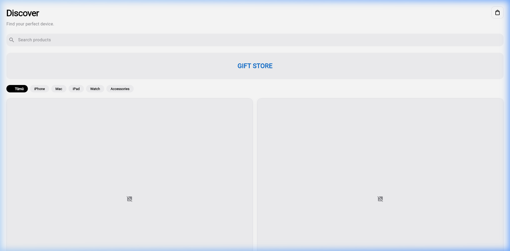
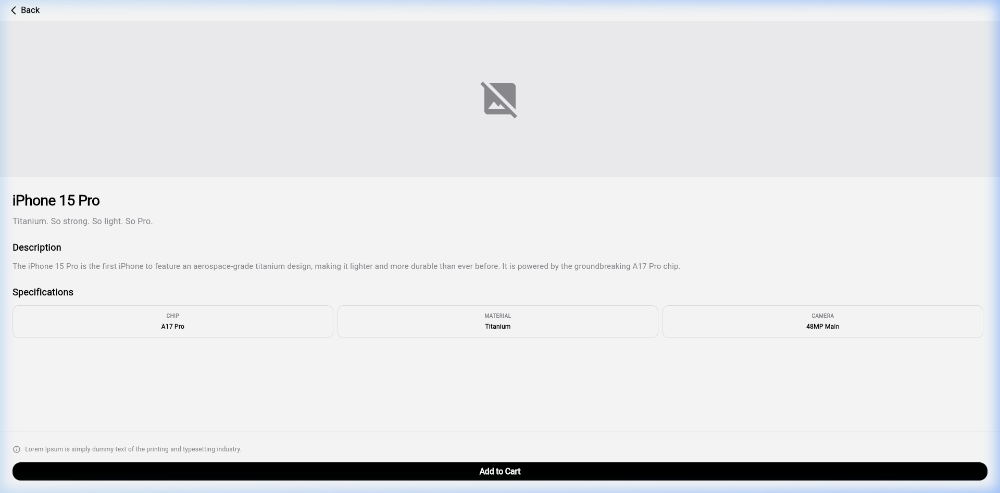
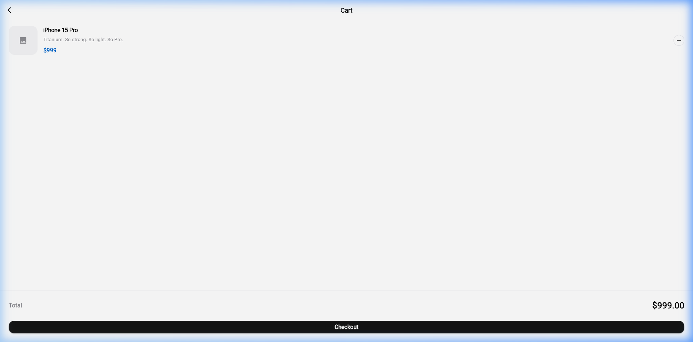

# Mini Katalog Uygulaması

Flutter haftalık eğitim projesi kapsamında geliştirilmiş bir mobil katalog uygulamasıdır.

## Proje Hakkında

Bu uygulama, Flutter'ın temel kavramlarını öğretmek amacıyla tasarlanmış bir eğitim projesidir. Apple ürün kataloğu simülasyonu üzerinden aşağıdaki konuları kapsar:

- **Widget yapısı** — Stateless ve Stateful Widget'lar
- **Sayfa geçişleri** — Navigator, Named Routes, Route Arguments
- **UI Tasarımı** — GridView, ListView, Card, AppBar, BottomNavigationBar
- **Veri modeli** — fromJson / toJson, JSON serileştirme
- **State yönetimi** — Basit state güncelleme (Singleton ile sepet simülasyonu)
- **Proje klasörleme** — models, screens, services, widgets, theme

## Kullanılan Flutter Sürümü

- **Flutter SDK**: >= 3.0.0
- **Dart SDK**: >= 3.0.0

## Proje Yapısı

```
mini_katalog/
├── assets/
│   ├── data/
│   │   └── products.json          # Ürün verileri (JSON)
│   └── images/                    # Görsel dosyalar
├── lib/
│   ├── main.dart                  # Uygulama giriş noktası
│   ├── models/
│   │   ├── product.dart           # Ürün veri modeli
│   │   └── cart_item.dart         # Sepet öğesi modeli
│   ├── screens/
│   │   ├── home_screen.dart       # Ana sayfa
│   │   ├── product_list_screen.dart  # Ürün listesi
│   │   ├── product_detail_screen.dart # Ürün detayı
│   │   └── cart_screen.dart       # Sepet ekranı
│   ├── services/
│   │   ├── product_service.dart   # Ürün veri servisi
│   │   └── cart_service.dart      # Sepet yönetimi
│   ├── theme/
│   │   └── app_theme.dart         # Tema ve renk paleti
│   └── widgets/
│       ├── product_card.dart      # Ürün kartı
│       └── category_chip.dart     # Kategori filtresi
└── pubspec.yaml                   # Paket konfigürasyonu
```

## Çalıştırma Adımları

### Gereksinimler
- Flutter SDK kurulu olmalıdır
- Android Emulator veya fiziksel Android cihaz

### Kurulum

```bash
# Projeyi klonlayın
git clone <repository-url>
cd mini_katalog

# Bağımlılıkları yükleyin
flutter pub get

# Uygulamayı çalıştırın
flutter run
```

## Ekranlar ve Ekran Görüntüleri

Proje değerlendirme kriterleri gereği, uygulamaya ait ekran görüntüleri aşağıda listelenmiştir. Lütfen projeyi teslim etmeden önce ilgili görsel dosyalarını `assets/images/` dizinine ekleyiniz veya linkleri güncelleyiniz.

| Ekran | Açıklama | Ekran Görüntüsü |
|-------|----------|-----------------|
| **Ana Sayfa** | 'Discover' tasarımı, arama ve ürün grid'i |  |
| **Ürün Detay** | Gelişmiş ürün görseli, teknik özellikler |  |
| **Sepet** | Adet yönetimi, toplam fiyat, sipariş simülasyonu |  |

## Kullanılan Paketler

- `material.dart` (Varsayılan Flutter paketi)
- Ekstra paket kullanılmamıştır.
